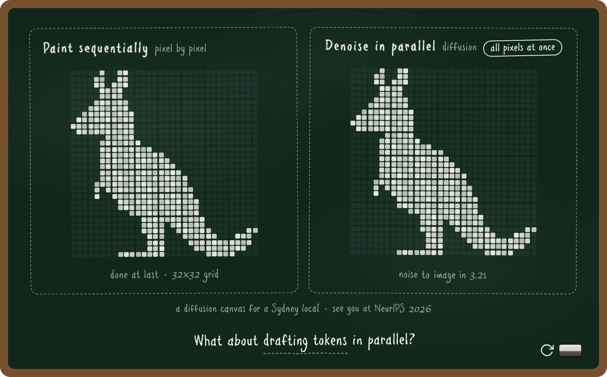
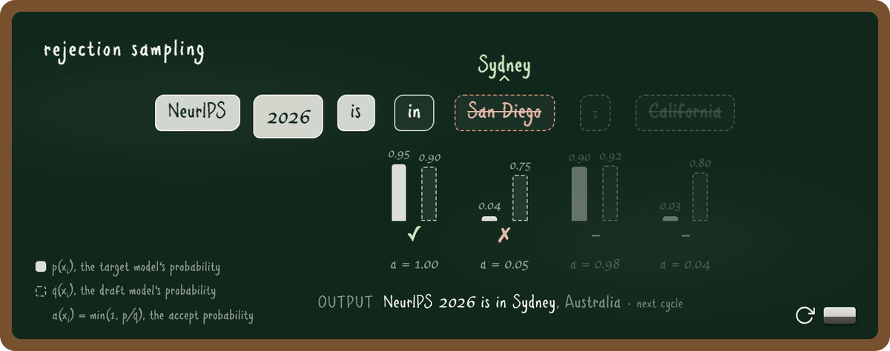
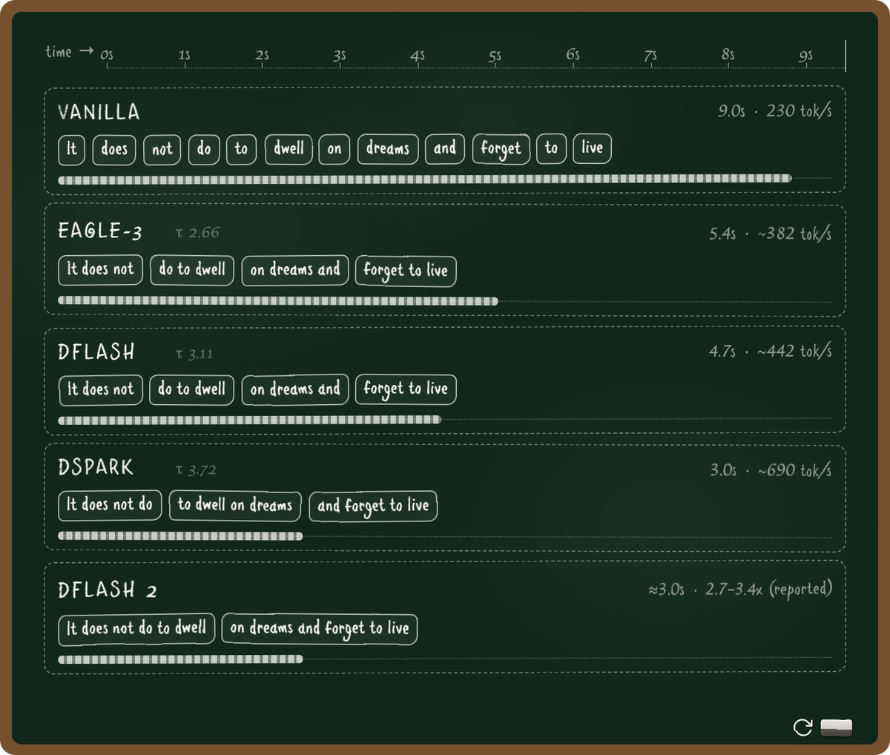

# Chalkboarding

A coding-agent skill for animated chalkboard figures: a green slate in a wooden frame, hand-drawn chalk lettering with a deliberately wobbly stroke, and elements that animate onto the board like a lecture unfolding. Built for the NeurIPS 2026 education paper *Speculative Decoding: How It Evolved, When It Stays Lossless, and What's Next*. The core `SKILL.md` can be read by any coding agent with filesystem and shell access.

<!-- To get inline playback on GitHub, drag examples/media/example1_kangaroo.mp4 into this
     README in the GitHub web editor; it becomes a user-attachments URL that renders as a player. -->
[](examples/media/example1_kangaroo.mp4)

*Click any figure to play the recorded MP4. Every figure below is one HTML file; the videos were rendered with `scripts/export_media.py`.*

## What This Does

**Chalkboarding** turns an idea into a self-contained HTML figure that looks like a teacher drew it on a board and animates like a lecture: elements appear in narrative order, a status line tells the viewer where they are, and an eraser button replays the whole thing. One file, no dependencies, embeds in any page via iframe, prints as a frozen final frame for papers, and exports to a crisp MP4 for Twitter.

The workflow is one idea applied repeatedly: **divide and conquer**. Never conceive and render in the same step. An ASCII mock separates *what the figure says* from *how it looks*. Tracing separates *the shape* from *the drawing of it*. An idempotent `paint(t)` separates *the story's beats* from *the rendering of any moment*.

### Key Features

- **Zero Dependencies** — Single HTML files with inline CSS/JS. Open them in a browser, embed them in a page, print them.
- **ASCII Mock First** — Layout and animation beats are sketched as an ASCII wireframe in chat and iterated cheaply before any styled HTML exists.
- **The Chalk Hand** — One font plus three layers of imperfection: SVG turbulence filters applied with probability that grows with stroke length, alternating micro-rotations, irregular corner radii. Everything that makes text read as hand-drawn lives in `fonts/`.
- **Trace, Don't Freehand** — Coding models have weak spatial sense. `scripts/trace_bitmap.py` turns any image (an emoji, a logo, a silhouette) into the pixel bitmap a figure consumes. The kangaroo was traced from the Twemoji kangaroo's alpha channel.
- **Replay, Reduced Motion, Print** — One `paint(t)` function renders any moment from scratch, so the eraser button, `prefers-reduced-motion`, and `beforeprint` all fall out for free.
- **Be Fun** — A great teacher reaches for silly concrete examples. Rejection sampling is "The best pet is a ___" with a cat and a dog. Parallel denoising is painting a kangaroo. The skill pushes for a character and an everyday story before it draws boxes.

## Installation

### Claude Code

Clone directly into your skills directory:

```bash
git clone https://github.com/lilyzhng/chalkboarding.git ~/.claude/skills/chalkboarding
```

Then type `/chalkboarding` in Claude Code. To use it in one project only, clone it anywhere and point Claude Code at `SKILL.md`.

### Other Coding Agents

Agents such as Codex, Kimi Code, OpenCode, Gemini CLI, or any local coding assistant can use the same skill. The simplest path is to send the agent this repo link and ask it to use the Chalkboarding skill:

```text
https://github.com/lilyzhng/chalkboarding
```

If the agent can read GitHub repos or browse files, it should start from `SKILL.md` and load only the referenced support files it needs:

- `design-system.md`
- `animation-patterns.md`
- `worked-examples.md`
- `template.html`
- `fonts/`
- `scripts/`

Some agents can also install the skill for you if they have filesystem access and a known local skills directory. If not, they can follow `SKILL.md` directly for the current session.

## Usage

### Create a New Figure

```text
/chalkboarding

> "A chalkboard figure for the diffusion analogy: two canvases painting the
>  same kangaroo, one pixel by pixel, one denoising all pixels at once"
```

The skill will:

1. Ask what the one idea is, and who the character is
2. Sketch an ASCII mock with an animation beat table, and iterate until you approve it
3. Trace any complex imagery from a reference instead of freehanding it
4. Convert the mock into chalkboard HTML from `template.html` using the design system
5. Screenshot start, mid, and final frames and check that the final frame carries the whole message alone

### Export for Twitter or a README

```bash
python3 scripts/export_media.py my_chalk.html                        # 1200px MP4, cropped to the board
python3 scripts/export_media.py my_chalk.html --seconds 11 --fps 30  # match the figure's own length
```

The exporter drives the page with a paused virtual clock and screenshots every frame at 2x, so the chalk stays sharp and the timing is exact. Add `--gif` if you need a GIF; it is bigger and softer.

### Trace an Image into a Pixel Grid

```bash
python3 scripts/trace_bitmap.py kangaroo.png --size 32   # prints the X/. bitmap array
```

## Examples

Three figures from the NeurIPS set. Click to play.

### The kangaroo: paint pixel by pixel vs denoise all at once

[](examples/media/example1_kangaroo.mp4)

Two 32x32 canvases paint the same kangaroo. The left one fills cell by cell and takes seven seconds. The right one starts as noise and converges every pixel at once in three. When it finishes, the hook lands: what about drafting tokens in parallel? The kangaroo was traced from an emoji with `scripts/trace_bitmap.py`, not drawn freehand.

### Rejection sampling: "NeurIPS 2026 is in ___"

[](examples/media/example3_rejection_sampling.mp4)

The draft proposes San Diego, the target prefers Sydney. Each token shows p and q as chalk bars and the accept probability underneath. Rejected tokens get struck through and corrected. The legend explains the three symbols in one line each.

### The decoding race

[](examples/media/example5_decoding_race.mp4)

Five decoders write the same sentence on a shared time axis. Vanilla places one chip per second. Each speculative decoder places a chunk per verification pass, so the lanes finish at different times and the acceptance length is visible as chunk width.

All eight figures live in `examples/`. Open any of them directly in a browser; they load the font from `../fonts/`.

| Figure | Idea |
|---|---|
| `example1_kangaroo.html` | Paint pixel by pixel vs denoise all at once |
| `example2_dog_and_cat.html` | "The best pet is a ___", strict vs relaxed verification, emoji sized by probability |
| `example3_rejection_sampling.html` | Rejection sampling with p, q, and accept bars per token |
| `example4_go_to_school.html` | Independent top-1 vs path selection, SVG curve draw-on |
| `example5_decoding_race.html` | Five decoders on the same sentence |
| `example6_twin_timelines.html` | Twin timeline panels with chips, chunks, and a playhead |
| `example7_dflash_flat_cost.html` | Drafting cost vs block size, interactive slider |
| `example8_dflash_kv_injection.html` | KV injection, many labeled SVG panels |

`worked-examples.md` records, for the richest ones, the regeneration prompt, the ASCII mock it implies, and the implementation tricks the finished files don't explain.

## Architecture

`SKILL.md` is a workflow map. Supporting files load on demand:

| File | Purpose | Loaded When |
| --- | --- | --- |
| `SKILL.md` | Three-phase workflow and the non-negotiables | Always |
| `design-system.md` | Exact colors, board construction, the chalk hand | Phase 2 (build) |
| `animation-patterns.md` | `paint(t)` model, chips, fills, playheads, pixel grids, SVG draw-on | Phase 2 (build) |
| `worked-examples.md` | Prompt, mock, and implementation notes for the example figures | Phase 2, when picking a starting point |
| `template.html` | Complete working skeleton with everything wired in | Phase 2 (build) |
| `chalkboard.css` | The template's base CSS as a standalone file | When pasting into an existing page |
| `fonts/` | The chalk face and the three-layer discontinuity system | Phase 2 (build) |
| `scripts/trace_bitmap.py` | Image to pixel-grid bitmap | Phase 2, for complex imagery |
| `scripts/screenshot_beats.py` | Start / mid / end QA screenshots | Phase 3 (QA) |
| `scripts/export_media.py` | Crisp MP4 export, cropped to the board | Sharing |

## Requirements

- A local coding agent with filesystem access and the ability to run shell commands
- For QA screenshots and media export: Python with `playwright` (Chromium installed) and `ffmpeg` on PATH
- For tracing: Python with `Pillow`

## Credits

Created by [@lily_gpupoor](https://x.com/lily_gpupoor) and [@Madisonkanna](https://x.com/Madisonkanna).

## License

MIT for the code. The font in `fonts/` is third-party; check its license before redistributing.
